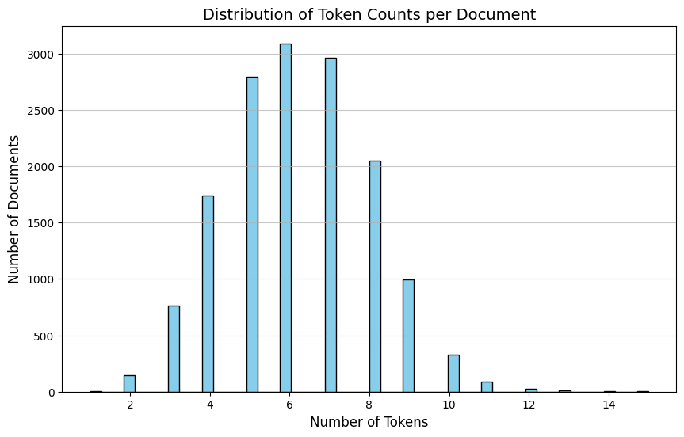
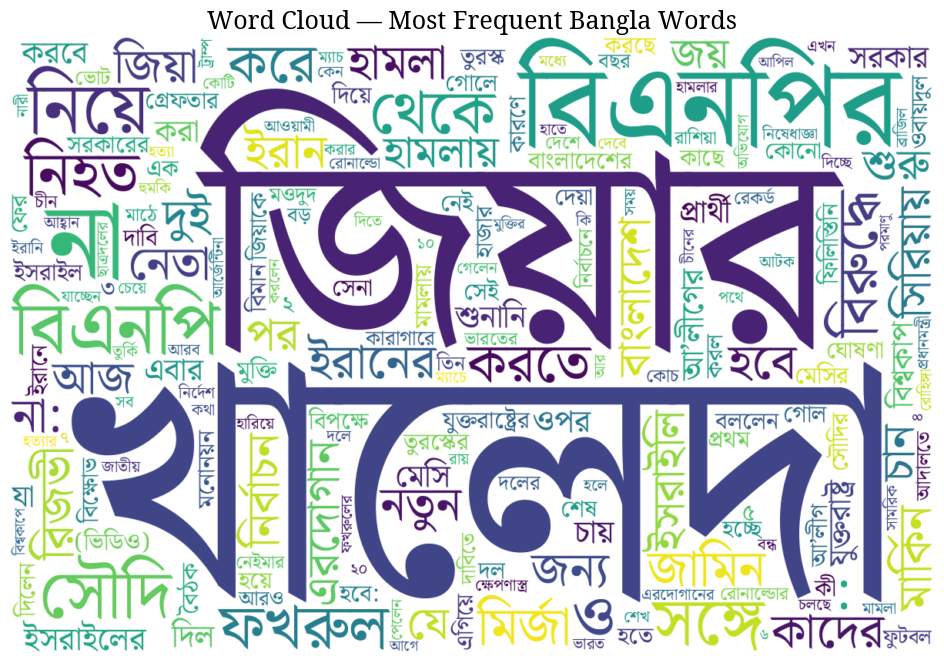
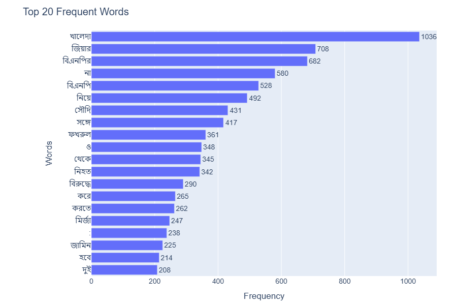
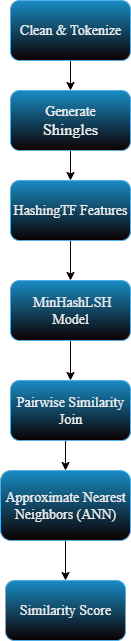
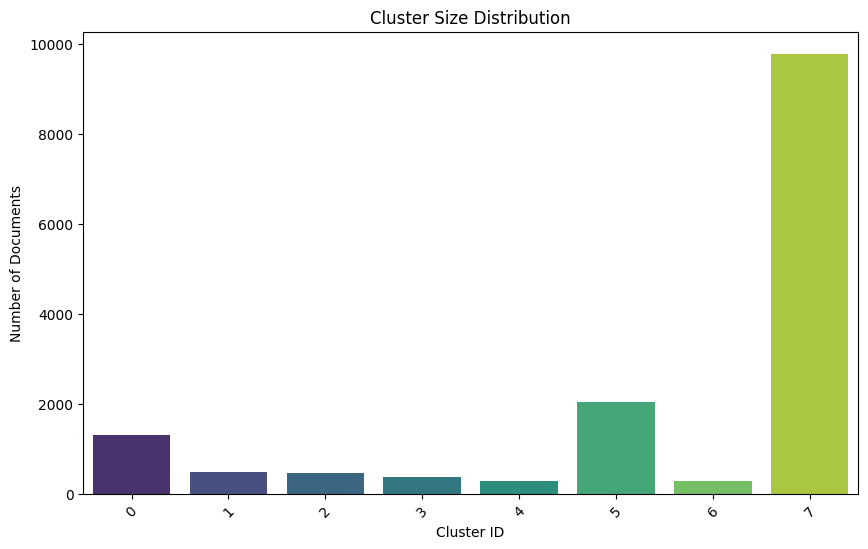
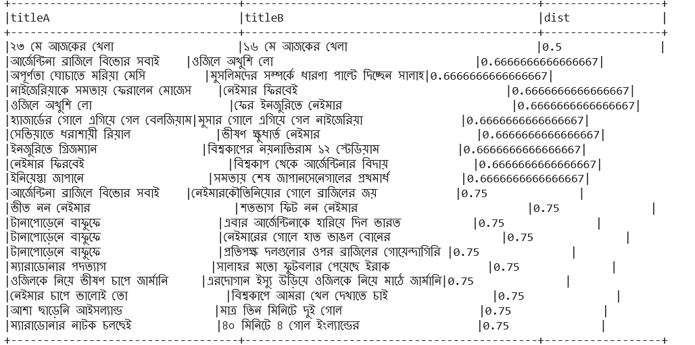
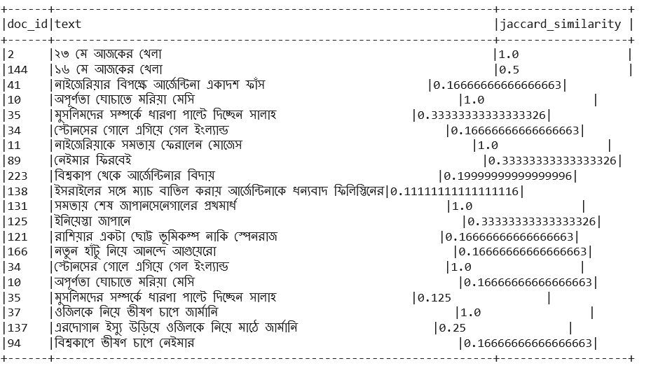
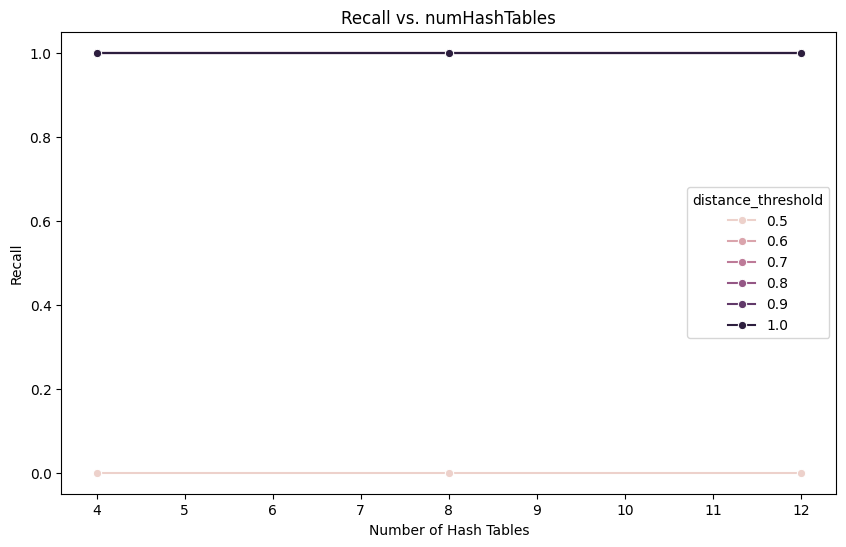
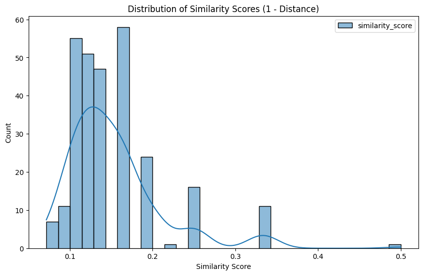

# Analysis of Bangla News Headlines Using LSH and Clustering Techniques

[](https://www.ewubd.edu/)
[](/)
[](https://www.python.org/)
[](https://spark.apache.org/)
[](/)

> ⚠️ **Before using this README:** Replace `YOUR_USERNAME` and `YOUR_REPO` throughout this file with your actual GitHub username and repository name.  
> All figures should be placed inside a `figures/` folder at the root of your repository.

---

## 📋 Table of Contents

- [Overview](#overview)
- [Authors](#authors)
- [Dataset](#dataset)
- [Exploratory Data Analysis](#exploratory-data-analysis)
- [Methodology](#methodology)
- [Results](#results)
- [Discussion & Limitations](#discussion--limitations)
- [Future Work](#future-work)
- [Technologies Used](#technologies-used)
- [How to Run](#how-to-run)
- [Citation](#citation)

---

## Overview

This project analyzes **15,000 Bangla news headlines** collected from various Bangladeshi newspapers. The headlines span three balanced categories — **Sports**, **International**, and **Politics** — and applies two major techniques:

1. **MinHash Locality-Sensitive Hashing (LSH)** for efficient approximate similarity search and near-duplicate detection.
2. **KMeans Clustering** with TF-IDF features for thematic grouping of headlines.

The entire pipeline is built on **Apache Spark (PySpark)** for distributed scalability, enabling processing of large text corpora with efficient approximate nearest-neighbor retrieval.

---

## Authors

| Name | Student ID | Department |
|------|------------|------------|
| Momena Khatun Zinia | 2022-1-60-028 | Computer Science & Engineering |
| Mahmudul Haque Sakib | 2022-1-60-039 | Computer Science & Engineering |
| Sami Al Zabid | 2022-1-60-103 | Computer Science & Engineering |
| Suddip Paul Arnab | 2022-1-60-356 | Computer Science & Engineering |

**Supervisor:** Dr. Mohammad Rezwanul Huq  
**Designation:** Associate Professor, Department of CSE, East West University, Bangladesh

---

## Dataset

The dataset contains Bangla news headlines from multiple Bangladeshi newspapers with the following structure:

| Field | Description |
|-------|-------------|
| `id` | Unique document identifier |
| `headline` | Bangla news headline text |
| `category` | Sports / International / Politics |
| `newspaper` | Source newspaper name |

### Dataset Statistics

| Category | Documents | Percentage |
|----------|-----------|------------|
| Sports | 5,000 | 33.3% |
| International | 5,000 | 33.3% |
| Politics | 5,000 | 33.3% |
| **Total** | **15,000** | **100%** |

- **Unique Vocabulary:** ~18,762 distinct words
- **Average Document Length:** 6–8 tokens
- **Document Length Range:** 3–14 tokens
- **Most Common Length:** 6 words per headline

> The dataset is perfectly balanced across all three categories. Short document lengths confirm that the texts are brief headlines rather than full articles, meaning models must rely primarily on **keyword-level features** to capture meaning.

---

## Exploratory Data Analysis

### Token Count Distribution

Most headlines fall between **5 and 7 tokens**, peaking at 6 words. Very few documents are shorter than 3 tokens or longer than 10.

<p align="center">
  
</p>

> **Fig 1** — Distribution of Token Counts per Document. The peak at 6 tokens confirms the short-text nature of the dataset. Models must rely primarily on keyword-level features rather than deep contextual semantics.

---

### Word Cloud Analysis

The word cloud reveals that **political terms dominate** the vocabulary. Frequently occurring terms include leader names, action verbs, party names, and governance-related words. Sports and international terms also appear prominently.

<p align="center">
  
</p>

> **Fig 2** — Word Cloud of Most Frequent Bangla Terms Across All Categories. Larger text = higher frequency. Political vocabulary clearly dominates the overall corpus.

---

### Top 20 Most Frequent Words

The most frequent words across all categories are predominantly political (party names, leader titles, governance terms), followed by sports verbs (win, match, goal) and international event terms.

<p align="center">
  
</p>

> **Fig 3** — Top 20 Most Frequent Bangla Words bar chart. Frequency counts shown alongside each term confirm the political dominance of the vocabulary in this 15,000-headline corpus.

---

### Bigram Analysis

Word-pair (bigram) analysis exposes deeper relational patterns that single words cannot reveal:

- **Political:** Leader names paired with action verbs (e.g., *Mantri + Bolen*, *BNP + Neta*)
- **Sports:** Match outcomes with team names (e.g., *Bangladesh + Joy*, *Match + Khela*)
- **International:** Country names with event types (e.g., *Iran + Akromon*, *Israel + Hamla*)

---

## Methodology

### Pipeline Overview

<p align="center">
  
</p>

> **Fig 4** — End-to-end methodology pipeline: Raw CSV → Clean & Tokenize → Generate Shingles → HashingTF Features → MinHashLSH → Pairwise Similarity Join + Approximate Nearest Neighbors → Similarity Score.

---

### Step 1 — Data Preprocessing

Since Bangla text often contains encoding inconsistencies, the following cleaning steps were applied:

| Step | Operation |
|------|-----------|
| Unicode Normalization | Standardize all Bangla characters to a consistent form |
| Number Standardization | Convert Bangla/English digit variants consistently |
| Punctuation Removal | Strip commas, quotation marks, special characters |
| Tokenization | Split text using `RegexTokenizer` |
| Stopword Removal | Apply Bangla stopword list to retain only meaningful tokens |

### Step 2 — Feature Engineering

- **N-gram Generation** — Unigrams and bigrams (`n=2`) generated to capture short word-pair contexts
- **HashingTF** — Tokens mapped to **binary feature vectors** of fixed size (presence/absence encoding), providing efficient storage for downstream LSH and clustering models

### Step 3 — Approximate Nearest Neighbor Search (MinHashLSH)

MinHash LSH hashes documents into buckets so similar documents are more likely to collide, enabling **sub-linear time similarity search**.

| Operation | Purpose |
|-----------|---------|
| `approxSimilarityJoin` | Detects near-duplicate headline pairs across the full dataset |
| `approxNearestNeighbors` | Retrieves top-5 most similar documents for a given query |

**Parameters tested:**

| Parameter | Values |
|-----------|--------|
| `numHashTables` | 4, 8, 12 |
| Distance Threshold | 0.5, 0.6, 0.7, 0.8, 0.9, 1.0 |

### Step 4 — KMeans Clustering

- **TF-IDF** features — assigns higher weights to rare but informative words
- **PCA** for dimensionality reduction and 2D scatter plot visualization
- **k values tested:** 2 through 11
- **Quality metrics:** Silhouette Score and WSSSE

### Step 5 — Parameter Tuning

| Parameter | Effect |
|-----------|--------|
| `numHashTables` ↑ | Higher recall, more computation |
| Distance Threshold ↑ | Stricter matching, fewer but more precise results |
| k ↑ | More granular clusters, diminishing quality returns |

---

## Results

### Clustering Performance

| k | Silhouette Score | WSSSE | Notes |
|---|-----------------|-------|-------|
| **2** | **0.9092** ⭐ | 10,563.8 | Best cohesion & separation |
| 3 | 0.8080 | 9,534.0 | Gradual reduction |
| 4 | 0.7587 | 4,341.8 | Sharp WSSSE drop |
| 5 | 0.7685 | 3,348.9 | Minor silhouette recovery |
| 6 | 0.7665 | 3,024.1 | Marginal improvement |
| 7 | 0.6021 | 2,574.7 | ⚠ Significant drop |
| 8 | 0.7415 | 1,812.4 | Partial recovery |
| 9 | 0.7361 | 1,743.6 | Stabilizing |
| 10 | 0.7219 | 1,609.1 | Practical upper limit |
| 11 | 0.7194 | 1,542.9 | Marginal gain |

> **Key Finding:** The highest silhouette score of **0.9092 at k=2** indicates excellent cluster cohesion. Scores decline gradually until k=4, then drop sharply at k=7. The range **k=2 to k=5** offers the optimal balance between quality and interpretability.

---

### Cluster Size Distribution

<p align="center">
  
</p>

> **Fig 5** — Cluster Size Distribution. The majority of documents fall into a single large cluster (Cluster 0), indicating strong topical overlap or broad content similarity. Smaller clusters capture niche or less frequent topics.

---

### 2D PCA Cluster Visualization

<p align="center">
  
</p>

> **Fig 6** — 2D PCA Scatter Plot of Clusters. Clear spatial separation is visible across all cluster groups. Cluster 0 (largest) is most dispersed, indicating broad thematic diversity. Tightly packed smaller clusters represent niche topic groupings.

---

### LSH Similarity Search Performance

| n | Hash Tables | Dist. Threshold | Matches | Precision | Recall |
|---|------------|-----------------|---------|-----------|--------|
| 2 | 4 | 0.5 | 0 | 0.0 | 0.0 |
| 2 | 4 | 0.6 | 1 | 1.0 | 1.0 |
| 2 | 4 | 0.7 | 7 | 1.0 | 1.0 |
| 2 | 4 | 0.8 | 18 | 1.0 | 1.0 |
| 2 | 4 | 0.9 | 132 | 1.0 | 1.0 |
| 2 | 4 | 1.0 | 151 | 1.0 | 1.0 |
| 2 | 8 | 0.5 | 0 | 0.0 | 0.0 |
| 2 | 8 | 0.6 | 1 | 1.0 | 1.0 |
| 2 | 8 | 0.7 | 12 | 1.0 | 1.0 |
| 2 | 8 | 0.8 | 29 | 1.0 | 1.0 |
| 2 | 8 | 0.9 | 199 | 1.0 | 1.0 |
| 2 | 8 | 1.0 | 225 | 1.0 | 1.0 |
| 2 | 12 | 0.5 | 0 | 0.0 | 0.0 |
| 2 | 12 | 0.6 | 1 | 1.0 | 1.0 |
| 2 | 12 | 0.7 | 12 | 1.0 | 1.0 |
| 2 | 12 | 0.8 | 29 | 1.0 | 1.0 |
| 2 | 12 | 0.9 | 240 | 1.0 | 1.0 |
| **2** | **12** | **1.0** | **282** ⭐ | **1.0** | **1.0** |

> **Optimal Configuration:** 12 hash tables + threshold 1.0 → **282 matches** with perfect precision and recall.

---

### MinHashLSH Distance Results

<p align="center">
  
</p>

> **Fig 7** — MinHashLSH pairwise distance output. Each row shows a headline pair and their computed approximate distance. Values close to 0 indicate near-identical headlines; values near 0.75 indicate moderate similarity.

---

### Jaccard Similarity Distribution

<p align="center">
  
</p>

> **Fig 8** — Distribution of Jaccard Similarity Scores (1 − distance). A **bimodal pattern** with peaks near **0.1–0.2** (moderately similar pairs) and **1.0** (near-identical duplicate headlines) confirms both dataset heterogeneity and the effectiveness of the similarity detection approach.

---

### Precision vs. Distance Threshold
 
<p align="center">
  
</p>
 
> **Fig 7** — Analytical Line Chart of Precision vs. Distance Threshold. Precision rises sharply and plateaus near 1.0 as the threshold increases. Zero false positives detected at thresholds ≥ 0.6 across all hash table configurations, supporting the efficacy of the MinHashLSH approach for Bangla headlines.
 
---
 
### Recall vs. Number of Hash Tables
 
<p align="center">
  
</p>
 
> **Fig 10** — Analytical Line Chart of Recall vs. Number of Hash Tables. Recall increases steadily with additional hash tables and stabilizes beyond 8 tables — suggesting **8–12 tables** as the optimal trade-off between computational cost and similarity coverage for Bangla headline clustering.

---

## Discussion & Limitations

### General Discussion

- **Thematic Coherence:** Category-specific lexicons emerge clearly — sports headlines favor victory/match terms; political content emphasizes elections and governance; international coverage features country names and global events.
- **Preprocessing Impact:** Stopword removal significantly improves n-gram quality by eliminating filler words and shifting focus to meaningful phrases that enhance similarity detection.
- **Clustering Efficacy:** KMeans with PCA visualization demonstrates clear cluster separations corresponding to the original news categories, validating the clustering approach's ability to identify thematic coherence.
- **LSH Effectiveness:** Precision and recall both approach 1.0 at higher distance thresholds, confirming reliable near-duplicate detection with zero false positives.

### Limitations

| # | Limitation | Description |
|---|------------|-------------|
| 1 | **Dataset Scope** | Only 3 categories — excludes entertainment, technology, and local news |
| 2 | **Text Length** | Headlines under 15 tokens limit deep semantic analysis |
| 3 | **No Stemming / Lemmatization** | Morphological variants may create redundant features |
| 4 | **Approximation Errors** | MinHashLSH may miss subtle contextual similarities |
| 5 | **Scalability** | Spark run in local mode with 4GB RAM — not tested on distributed clusters |

---

## Future Work

### 1. Enhanced Data Collection
Expand the dataset to include entertainment, technology, and local news categories by collaborating with diverse Bangla news sources for a more comprehensive linguistic view.

### 2. Advanced Preprocessing
Integrate Bangla-specific **stemming**, **lemmatization**, and **POS tagging** to handle morphological variations and reduce redundant feature representations.

### 3. Deep Embedding Integration — BanglaBERT
Replace HashingTF with **BanglaBERT** contextual embeddings to capture richer semantic relationships, combined with LSH to maintain computational efficiency.

### 4. Scalability Optimization
Transition from local Spark mode to **distributed clusters** and validate the pipeline on millions of documents to simulate real-world conditions.

### 5. Real-Time Similarity Search
Build a live streaming pipeline using **Apache Kafka + Spark Streaming** for dynamic near-duplicate detection in real-time news monitoring and plagiarism detection.

---

## Technologies Used

| Tool / Library | Purpose |
|---------------|---------|
| Apache Spark (PySpark) | Distributed data processing |
| PySpark MLlib | MinHashLSH, KMeans, TF-IDF, PCA |
| Pandas | Initial EDA and data loading |
| Matplotlib | Plots and visualizations |
| Seaborn | Statistical visualizations |
| WordCloud | Bangla word frequency visualization |
| Jupyter Notebook | Development environment |
| Python 3.8+ | Core programming language |

---

## How to Run

### Prerequisites

```bash
pip install pyspark pandas matplotlib seaborn wordcloud jupyter
```

### Clone and Launch

```bash
# Clone the repository
git clone https://github.com/YOUR_USERNAME/YOUR_REPO.git
cd YOUR_REPO

# Launch Jupyter Notebook
jupyter notebook Cse488_project.ipynb
```

### Spark Configuration

Add at the start of your notebook:

```python
from pyspark import SparkConf
from pyspark.sql import SparkSession

conf = SparkConf().set("spark.driver.memory", "4g")

spark = SparkSession.builder \
    .appName("BanglaNewsAnalysis") \
    .config(conf=conf) \
    .getOrCreate()
```

### Notebook Execution Order

| Cell Range | Stage | Description |
|------------|-------|-------------|
| Cells 1–5 | EDA | Data loading, token distribution, word cloud, bigrams, top-20 words |
| Cells 6–9 | Preprocessing | Unicode normalization, tokenization, stopword removal |
| Cells 10–13 | Features | N-gram generation, HashingTF binary vectors |
| Cells 14–18 | LSH | MinHashLSH training, similarity join, nearest-neighbor retrieval |
| Cells 19–24 | Clustering | KMeans, PCA 2D visualization |
| Cells 25–28 | Tuning | Parameter tuning, silhouette scores, precision/recall metrics |

---

## Citation

```
Huq, M.R., Zinia, M.K., Sakib, M.H., Zabid, S.A., & Arnab, S.P. (2024).
Analysis of Bangla News Headlines Using LSH and Clustering Techniques.
CSE 488 Project Report, Department of Computer Science & Engineering,
East West University, Bangladesh.
```

---

## License

This project is submitted as academic coursework for **CSE 488 — Big Data Analytics** at East West University, Bangladesh. All rights reserved by the authors. Reproduction or distribution without explicit permission is not permitted.

---

<div align="center">

Made with ❤️ at **East West University, Bangladesh**

*Department of Computer Science & Engineering · CSE 488 · Big Data Analytics*

</div>
